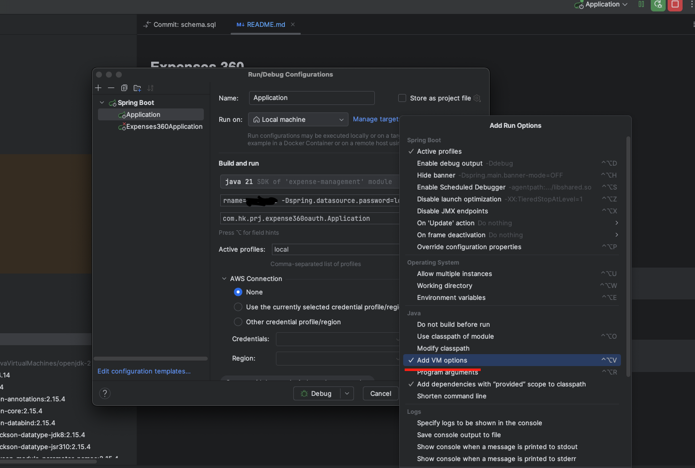

# Expenses Management App
- Manage Your expenses

## Tech Stack
- Thymeleaf
- Java 21
- Springboot 3.3.5
- Postgres
- Google OAuth

## Pre-requisite to run application
- [Java 21](https://www.oracle.com/java/technologies/downloads/#java21) 
- [Postgres](docs/postgres-steps.md) 
- Create a local postgres database with name - *expense_management*
- OAuth Setup - Create Client ID and Client Secret in Google Console - [Steps](docs/oauth-setup-steps.md)
  - Add these VM arguments in IDE to Enable Google OAuth in local environment
    ```
    -Dspring.security.oauth2.client.registration.google.client-id=REPLACE_ME
    -Dspring.security.oauth2.client.registration.google.client-secret=REPLACE_ME
    ``` 
* VM Arguments for intellij IDE


## Run Using Docker Compose
 - Step 1: Add GOOGLE_CLIENT_ID and GOOGLE_CLIENT_SECRET from Pre-requisite steps to file [oauth.txt](oauth.txt)
 - Step 2. Run command in terminal inside expense-management folder
```bash
docker compose up --build
```   

## Containerization References
- [Dockerfile](Dockerfile)
- [Docker Tutorial Guide](https://docs.docker.com/language/java/)